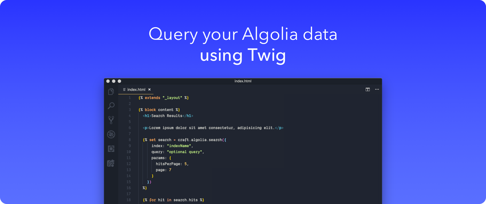

#  Algolia



## About

Algolia for Craft CMS allows you to easily pull search results from Algolia into your Twig templates or through REST API endpoints.

## Template Usage

### Browse an index

[Additional search parameters](https://www.algolia.com/doc/api-reference/search-api-parameters/) can be provided in the `params` object.

```twig



```

### Search an index

[Additional search parameters](https://www.algolia.com/doc/api-reference/search-api-parameters/) can be provided in the `params` object.

```twig





```

### Perform a multiple query search

[Additional search parameters](https://www.algolia.com/doc/api-reference/search-api-parameters/) can be provided in each `queries` object.

```twig



  

  

```

## Using JSON REST API controllers
In additional to Twig variables you can make a `POST` request to one of the following controller endpoints. The same index, query and optional attributes are available when you make your `POST` request.

**NOTE**: The way you pass the example body params to your request depends greatly on the tool you are using to reach these endpoints. `axios`, `$.post` and other utilities will have slightly different ways to pass this data. **Don't forget to pass along your CSRF tokens to verify your request!**

### Browse an index (`/actions/algolia/default/browse`)

[Additional search parameters](https://www.algolia.com/doc/api-reference/search-api-parameters/) can be provided in the `params` object.

```json
{
  "index": "indexName",
  "query": "optional query",
  "params": {
    "distinct": true,
    "getRankingInfo": true
  }
}
```

### Search an index (`/actions/algolia/default/search`)

[Additional search parameters](https://www.algolia.com/doc/api-reference/search-api-parameters/) can be provided in the `params` object.

```json
{
  "index": "indexName",
  "query": "your query",
  "params": {
    "hitsPerPage": 5,
    "page": 7
  }
}
```

### Perform a multiple query search (`/actions/algolia/default/multiple-queries`)

[Additional search parameters](https://www.algolia.com/doc/api-reference/search-api-parameters/) can be provided in each `queries` object.

```json
{
 "queries": [
    {
      "indexName": "indexName1",
      "query": "optional query"
    },
    {
      "indexName": "indexName2",
      "query": "optional query"
    }
  ]
}
```

## Requirements

This plugin requires Craft CMS 3.0.0-beta.23 or later.

## Installation

To install the plugin, follow these instructions.

1. Open your terminal and go to your Craft project:

        cd /path/to/project

2. Then tell Composer to load the plugin:

        composer require trendyminds/algolia

3. In the Control Panel, go to Settings → Plugins and click the “Install” button for Algolia.

## Attribution
This plugin is powered by the [Algolia PHP API client](https://www.algolia.com/doc/api-client/getting-started/install/php/). The client and icon/logo belong to Algolia.
