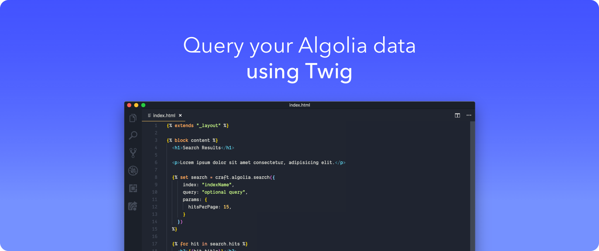

#  Algolia



## About

Algolia for Craft CMS allows you to easily pull search results from Algolia into your Twig templates or through REST API endpoints.

## Template Usage

### Browse an index

[Additional search parameters](https://www.algolia.com/doc/api-reference/search-api-parameters/) can be provided in the `params` object.

```twig



```

### Search an index

[Additional search parameters](https://www.algolia.com/doc/api-reference/search-api-parameters/) can be provided in the `params` object.

```twig





```

### Perform a multiple query search

[Additional search parameters](https://www.algolia.com/doc/api-reference/search-api-parameters/) can be provided in each `queries` object.

```twig



  

  

```

## Using JSON REST API controllers
In additional to Twig variables you can make a `POST` request to one of the following controller endpoints. The same index, query and optional attributes are available when you make your `POST` request.

**NOTE**: The following examples use [Axios](#) for making API requests

### Browse an index

[Additional search parameters](https://www.algolia.com/doc/api-reference/search-api-parameters/) can be provided in the `params` object.

```js
axios.post("/actions/algolia/default/browse", {
  index: "indexName",
  query: "optional query",
  params: {
    distinct: true,
    getRankingInfo: true
  }
}, {
  headers: {
    "X-CSRF-Token": YOUR_CRAFT_CSRF_TOKEN
  }
});
```

### Search an index

[Additional search parameters](https://www.algolia.com/doc/api-reference/search-api-parameters/) can be provided in the `params` object.

```js
axios.post("/actions/algolia/default/search", {
  index: "indexName",
  query: "optional query",
  params: {
    hitsPerPage: 5,
    page: 7
  }
}, {
  headers: {
    "X-CSRF-Token": YOUR_CRAFT_CSRF_TOKEN
  }
});
```

### Perform a multiple query search (`/actions/algolia/default/multiple-queries`)

[Additional search parameters](https://www.algolia.com/doc/api-reference/search-api-parameters/) can be provided in each `queries` object.

```js
axios.post("/actions/algolia/default/multiple-queries", {
  queries: [
    {
      indexName: "indexName1",
      query: "optional query"
    },
    {
      indexName: "indexName2",
      query: "optional query"
    }
  ]
}, {
  headers: {
    "X-CSRF-Token": YOUR_CRAFT_CSRF_TOKEN
  }
});
```

## Requirements

This plugin requires Craft CMS 3.0.0-beta.23 or later.

## Installation

To install the plugin, follow these instructions.

1. Open your terminal and go to your Craft project:

        cd /path/to/project

2. Then tell Composer to load the plugin:

        composer require trendyminds/algolia

3. In the Control Panel, go to Settings → Plugins and click the “Install” button for Algolia.

## Attribution
This plugin is powered by the [Algolia PHP API client](https://www.algolia.com/doc/api-client/getting-started/install/php/). The client and icon/logo belong to Algolia.
